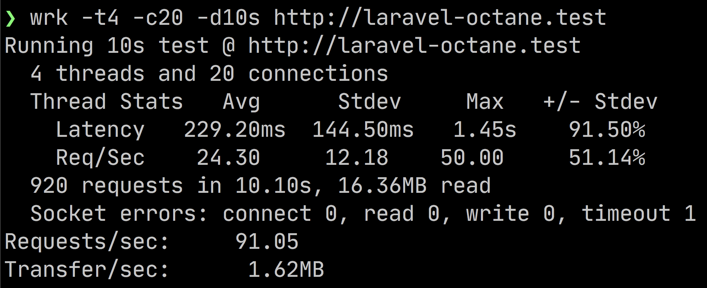
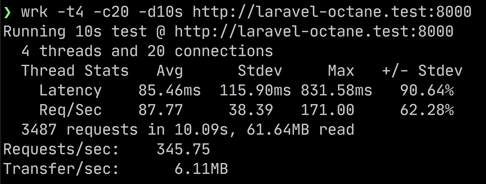

# laravel-octane-demo

## Compare between Nginx with Roadrunner

For nginx:

For Roadrunner:

Command to test: `wrk -t4 -c20 -d10s http://laravel-octane.test`

The main difference with serving the Laravel application with Laravel Octane + Roadrunner instead of the classic Web server is:

- The Application is bootstrapped once, and multiple request will share same resources;
- The construct of the controller are called once (when the worker is instanced);
- Think about what happens to “static” class attribute.
